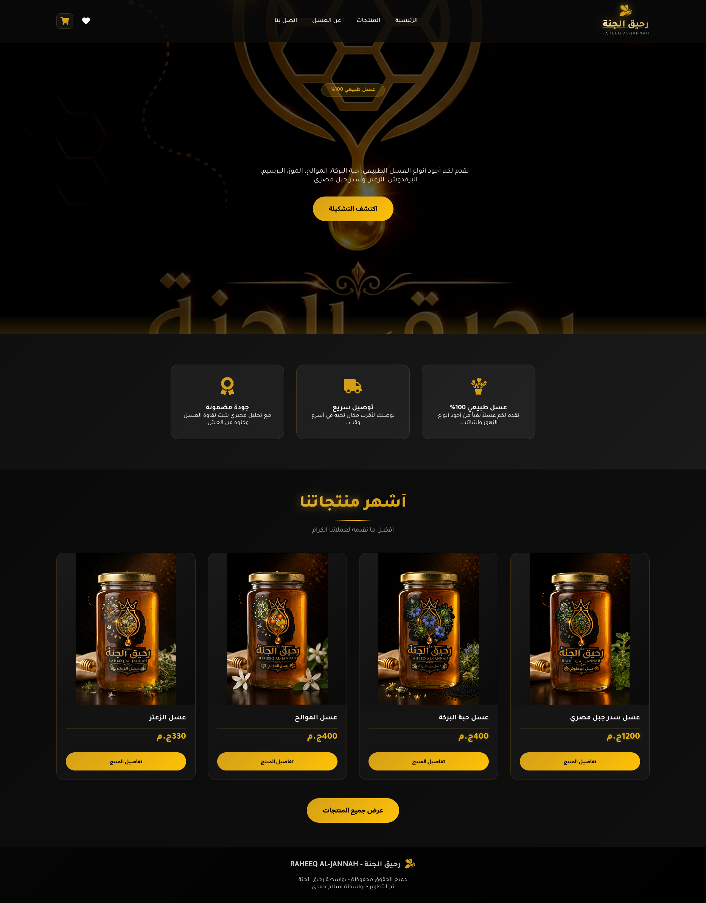
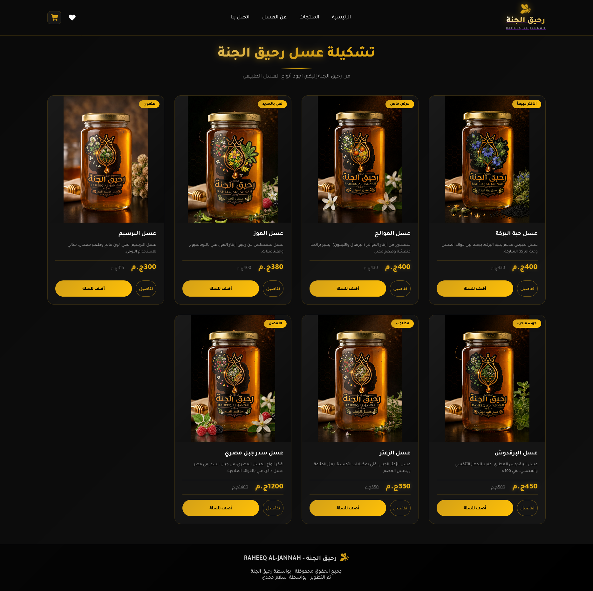
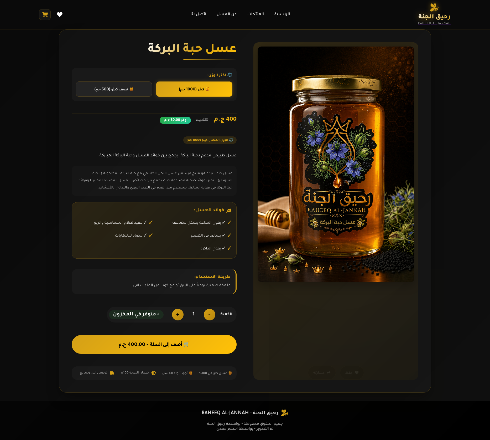

# RAHEEQ AL JANNAH 🍯

RAHEEQ AL JANNAH is a modern e-commerce web application designed specifically for a premium honey brand. The platform provides a seamless catalog and ordering experience, showcasing high-quality honey products with a clean, professional aesthetic that emphasizes purity and nature.

**Live Demo:** [raheeq-al-jannah.vercel.app](https://raheeq-al-jannah.vercel.app)

---

## 📖 Project Description

The "Rahieq Al Janna" platform serves as a digital storefront and product catalog. It was built to bridge the gap between traditional honey production and modern digital consumers, offering an intuitive interface for users to explore different honey varieties, understand their benefits, and place orders.

### Key Features:
*   **Dynamic Product Catalog:** An organized display of honey products with detailed descriptions.
*   **Responsive Design:** Fully optimized for mobile, tablet, and desktop viewing.
*   **Modern UI/UX:** A clean, nature-inspired design language tailored to the brand's identity.
*   **Interactive Ordering System:** A streamlined process for customers to select products and initiate orders.

---

## 🛠 Tech Stack

The project leverages a modern frontend stack to ensure high performance, scalability, and a smooth user experience.

*   **Frontend Library:** [React](https://reactjs.org/) - Used for building a component-based, reactive user interface.
*   **Styling:** [Tailwind CSS](https://tailwindcss.com/) - Utilized for rapid UI development and highly customizable, responsive styling.
*   **Deployment:** [Vercel](https://vercel.com/) - Used for continuous integration and hosting the live production environment.
*   **Version Control:** Git & GitHub.

---

## Screenshots

### Demo Home
  - 

### Demo Product
  - 

### Demo Product Details
  - 

### Project Video Demo
  - [▶️ Watch Project Video](public/video.mp4)

---

## 🚀 Getting Started

To get a local copy up and running, follow these simple steps:

1.  **Clone the repository**
    ```bash
    git clone https://github.com/Islam412/RAHEEQ-AL-JANNAH.git
    ```
2.  **Navigate to the project directory**
    ```bash
    cd RAHEEQ-AL-JANNAH
    ```
3.  **Install dependencies**
    # RAHEEQ AL JANNAH 🍯

RAHEEQ AL JANNAH is a modern e-commerce web application designed specifically for a premium honey brand. The platform provides a seamless catalog and ordering experience, showcasing high-quality honey products with a clean, professional aesthetic that emphasizes purity and nature.

**Live Demo:** [raheeq-al-jannah.vercel.app](https://raheeq-al-jannah.vercel.app)

---

## 📖 Project Description

The "Rahieq Al Janna" platform serves as a digital storefront and product catalog. It was built to bridge the gap between traditional honey production and modern digital consumers, offering an intuitive interface for users to explore different honey varieties, understand their benefits, and place orders.

### Key Features:
*   **Dynamic Product Catalog:** An organized display of honey products with detailed descriptions.
*   **Responsive Design:** Fully optimized for mobile, tablet, and desktop viewing.
*   **Modern UI/UX:** A clean, nature-inspired design language tailored to the brand's identity.
*   **Interactive Ordering System:** A streamlined process for customers to select products and initiate orders.

---

## 🛠 Tech Stack

The project leverages a modern frontend stack to ensure high performance, scalability, and a smooth user experience.

*   **Frontend Library:** [React](https://reactjs.org/) - Used for building a component-based, reactive user interface.
*   **Styling:** [Tailwind CSS](https://tailwindcss.com/) - Utilized for rapid UI development and highly customizable, responsive styling.
*   **Deployment:** [Vercel](https://vercel.com/) - Used for continuous integration and hosting the live production environment.
*   **Version Control:** Git & GitHub.

---

## 🚀 Getting Started

To get a local copy up and running, follow these simple steps:

1.  **Clone the repository**
    ```bash
    git clone https://github.com/Islam412/RAHEEQ-AL-JANNAH.git
    ```
2.  **Navigate to the project directory**
    ```bash
    cd RAHEEQ-AL-JANNAH
    ```
3.  **Install dependencies**
    ```bash
    npm install
    ```
4.  **Start the development server**
    ```bash
    npm start
    ```

---

## ✒️ Author

**# RAHEEQ AL JANNAH 🍯

RAHEEQ AL JANNAH is a modern e-commerce web application designed specifically for a premium honey brand. The platform provides a seamless catalog and ordering experience, showcasing high-quality honey products with a clean, professional aesthetic that emphasizes purity and nature.

**Live Demo:** [raheeq-al-jannah.vercel.app](https://raheeq-al-jannah.vercel.app)

---

## 📖 Project Description

The "Rahieq Al Janna" platform serves as a digital storefront and product catalog. It was built to bridge the gap between traditional honey production and modern digital consumers, offering an intuitive interface for users to explore different honey varieties, understand their benefits, and place orders.

### Key Features:
*   **Dynamic Product Catalog:** An organized display of honey products with detailed descriptions.
*   **Responsive Design:** Fully optimized for mobile, tablet, and desktop viewing.
*   **Modern UI/UX:** A clean, nature-inspired design language tailored to the brand's identity.
*   **Interactive Ordering System:** A streamlined process for customers to select products and initiate orders.

---

## 🛠 Tech Stack

The project leverages a modern frontend stack to ensure high performance, scalability, and a smooth user experience.

*   **Frontend Library:** [React](https://reactjs.org/) - Used for building a component-based, reactive user interface.
*   **Styling:** [Tailwind CSS](https://tailwindcss.com/) - Utilized for rapid UI development and highly customizable, responsive styling.
*   **Deployment:** [Vercel](https://vercel.com/) - Used for continuous integration and hosting the live production environment.
*   **Version Control:** Git & GitHub.

---

## 🚀 Getting Started

To get a local copy up and running, follow these simple steps:

1.  **Clone the repository**
    ```bash
    git clone https://github.com/Islam412/RAHEEQ-AL-JANNAH.git
    ```
2.  **Navigate to the project directory**
    ```bash
    cd RAHEEQ-AL-JANNAH
    ```
3.  **Install dependencies**
    ```bash
    npm install
    ```
4.  **Start the development server**
    ```bash
    npm start
    ```

---

## ✒️ Author

**Islam Hamdy**
*   GitHub: [@Islam412](https://github.com/Islam412)
*   Role: Full-# RAHEEQ AL JANNAH 🍯

RAHEEQ AL JANNAH is a modern e-commerce web application designed specifically for a premium honey brand. The platform provides a seamless catalog and ordering experience, showcasing high-quality honey products with a clean, professional aesthetic that emphasizes purity and nature.

**Live Demo:** [raheeq-al-jannah.vercel.app](https://raheeq-al-jannah.vercel.app)

---

## 📖 Project Description

The "Rahieq Al Janna" platform serves as a digital storefront and product catalog. It was built to bridge the gap between traditional honey production and modern digital consumers, offering an intuitive interface for users to explore different honey varieties, understand their benefits, and place orders.

### Key Features:
*   **Dynamic Product Catalog:** An organized display of honey products with detailed descriptions.
*   **Responsive Design:** Fully optimized for mobile, tablet, and desktop viewing.
*   **Modern UI/UX:** A clean, nature-inspired design language tailored to the brand's identity.
*   **Interactive Ordering System:** A streamlined process for customers to select products and initiate orders.

---

## 🛠 Tech Stack

The project leverages a modern frontend stack to ensure high performance, scalability, and a smooth user experience.

*   **Frontend Library:** [React](https://reactjs.org/) - Used for building a component-based, reactive user interface.
*   **Styling:** [Tailwind CSS](https://tailwindcss.com/) - Utilized for rapid UI development and highly customizable, responsive styling.
*   **Deployment:** [Vercel](https://vercel.com/) - Used for continuous integration and hosting the live production environment.
*   **Version Control:** Git & GitHub.

---


---

## ✒️ Author

**Islam Hamdy**
*   GitHub: [@Islam412](https://github.com/Islam412)
*   Role: Full-Stack Web Developer